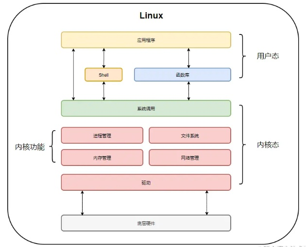

# my-python


### 生成器和迭代器

#### yield
    yield 会暂停保存当前所有的运行消息, 返回yield值, 下一次next的时候调用
1. 生成器
2. 定义上下文(实现了__nter__, __exit__方法)
3. 协程
4. 配合from, yield from 用于子生成器传递信息


### tips
    assert 断言
    assert a == 1, 'a can not == 1'

### 进程, 线程, 协程
1. 进程是CPU资源分配的基本单位，线程是独立运行和独立调度的基本单位（CPU上真正运行的是线程）。
2. 进程拥有自己的资源空间，一个进程包含若干个线程，线程与CPU资源分配无关，多个线程共享同一进程内的资源。
3. 线程的调度与切换比进程快很多。


GIL 锁：同一时刻，只能有一个线程在一个CPU上执行字节码
线程释放资源：
* cpython 的间隔性检查，线程会计算其执行的字节码数量，如果达到阈值，则会释放 dis.dis(func) 反编译， sys.getcheckinterval(50)
* IO 操作
```commandline
import sys
sys.getcheckinterval(50)  设置阈值
```


* 同步: 阻塞是指调用线程或者进程被操作系统挂起。
* 异步：非阻塞是指调用线程或者进程不会被操作系统挂起。



* CPU指令集： ring0, ring1, ring2, ring3

* 内核态：应用程序执行系统调用时的状态
* 用户态：应用程序中执行

